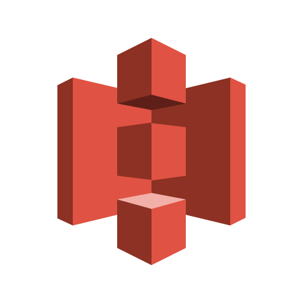

  

  <h1>Hello Cruel World! 👋</h1>
  
  
<big>AI & Backend Engineer</big>

   

## 👋 About Me

I architect **intelligent agent systems**, **multi-LLM orchestration pipelines**, and **high-performance backend microservices**. My work sits at the intersection of distributed systems engineering and applied AI.
 

## 🛠️ Tech Arsenal

**🧠 AI / LLM Engineering**

  
  
  
  
  
  
  
  
  
  
  
  
  
  
  
  
  
  
  
  
  

**⚙️ Backend & APIs**

  
  
  
  
  
  
  
  
  

**🗄️ Data & Infrastructure**

  
  
  
  
  
  
  
  
  
  
  

**📊 DevOps & Observability**

  
  
  
  
  
  
  
  
  
  
  

**📱 Mobile**

  
  
  

 

## 📊 GitHub Stats

 

 

 

### 📫 Let's Connect

 

